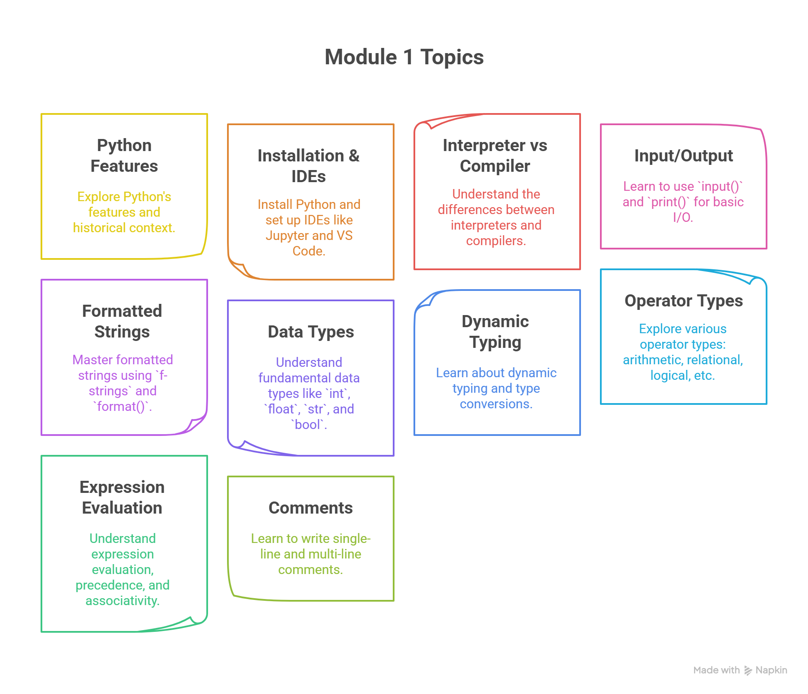

MBU MCA Python Course Content Documentation
==========================================

.. toctree::
   :maxdepth: 1
   :hidden:

   module1_features_and_history_of_python
   module1_installation_and_ides
   module1_interpreter_vs_compiler
   module1_input_output_and_data_types
   module1_operators_expressions_comments
   module1_assignment
   module2_decision_making
   module2_looping
   module2_functions_enumerate_zip
   module2_else_with_loops
   module2_comprehensions
   module2_combining_loops_conditionals
   module2_exception_handling
   module2_assignment

Welcome to the official documentation for the **MCA First-Year Python Programming** course at Mohan Babu University. This documentation is based on the course content curated by Zaid Kamil for the 2025 batch.

Course Overview
---------------
This documentation is designed to help MCA first-year students master the essentials of Python programming. The course provides both conceptual clarity and practical exposure, with a blend of theoretical notes, code snippets, assignments, and mini projects.

Course Structure
----------------

**Module 1: Introduction to Python, Input/Output and Operators (7 Periods)**

- Features and history of Python
- Installation & IDEs (Jupyter, VS Code)
- Interpreter vs Compiler
- Using input() and print()
- Formatted strings (f-strings, format)
- Data types: int, float, str, bool
- Dynamic typing & type conversions (explicit, implicit)
- Operator types: arithmetic, relational, logical, bitwise, assignment, membership, identity
- Expression evaluation, precedence & associativity
- Comments: single-line & multi-line

**Module 2: Decision Making and Looping (7 Periods)**

- ``if``, ``if-else``, ``elif``, nested conditions
- Loops: ``for``, ``while``, ``break``, ``continue``, ``pass``
- Functions: ``enumerate()``, ``zip()``
- ``else`` with loops
- List and dictionary comprehensions
- Combining loops with conditionals
- Basic exception handling: ``try-except``

**Module 3: Data Structures, Strings, Functions & Recursion (10 Periods)**

- Strings: creation, indexing, slicing, immutability
- String methods: ``upper()``, ``lower()``, ``find()``, ``replace()``, ``split()``, ``join()``
- Data structures: lists, tuples, dictionaries, sets
- Function definition, parameters, return values, default/keyword arguments
- Recursion (examples: factorial, Fibonacci)
- Function integration with strings & collections
- Lambda functions, ``map()``, ``filter()``

**Module 4: Object-Oriented Programming in Python (7 Periods)**

- Classes and objects
- Instance variables and methods
- Constructors (``__init__``) & destructors
- Encapsulation (public, protected, private)
- Inheritance (types, method overriding)
- Polymorphism
- Abstraction (using ``abc`` module)

**Module 5: Data Visualization & Web Development (14 Periods)**

- Importance & purpose of data visualization
- NumPy, Pandas, Matplotlib: line graphs, bar charts, histograms, scatter plots
- Flask: overview, setup, app structure, routing
- Template rendering with Jinja2
- Form handling: GET/POST methods
- Basic CRUD operations
- HTML/CSS integration
- Mini project implementation

Course Outcomes
---------------
After completion of this course, students will be able to:

- Demonstrate knowledge of Python constructs, sequences, sets, and dictionaries to solve computational problems.
- Apply regular expressions for pattern searching in strings.
- Develop and use Python modules to solve problems.
- Apply file operations in Python for file processing.
- Design applications using OOP features: encapsulation, inheritance, polymorphism, and exception handling.
- Work independently to solve problems and communicate effectively.

How to Use This Documentation
-----------------------------
- Each module has a dedicated section with lecture notes, code samples, and exercises.
- Access the notes in reStructuredText format for easy reading and sharing.
- Refer to the code samples and mini projects for hands-on practice.

Contributing
------------
Contributions are welcome! If you find any issues or have suggestions for improvement, feel free to open an issue or submit a pull request.

License
-------
This documentation is for educational purposes at Mohan Babu University. Please contact the maintainer for reuse or distribution outside the university.

Module 1 Navigation
-------------------

- :doc:`Features and History of Python <module1_features_and_history_of_python>`
- :doc:`Installation & IDEs <module1_installation_and_ides>`
- :doc:`Interpreter vs Compiler <module1_interpreter_vs_compiler>`
- :doc:`Input/Output and Data Types <module1_input_output_and_data_types>`
- :doc:`Operators, Expressions, and Comments <module1_operators_expressions_comments>`
- :doc:`Assignment Questions <module1_assignment>`

Module 2 Navigation
-------------------

- :doc:`Decision Making <module2_decision_making>`
- :doc:`Looping <module2_looping>`
- :doc:`Functions: enumerate() and zip() <module2_functions_enumerate_zip>`
- :doc:`else with Loops <module2_else_with_loops>`
- :doc:`List and Dictionary Comprehensions <module2_comprehensions>`
- :doc:`Combining Loops with Conditionals <module2_combining_loops_conditionals>`
- :doc:`Exception Handling <module2_exception_handling>`
- :doc:`Assignment Questions <module2_assignment>`

*Curated by Zaid Kamil for Mohan Babu University, 2025.*

